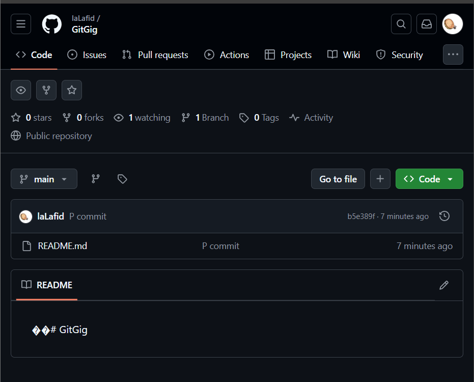

# Cara Menggunakan Git

## Persiapan 

1. [Git](https://git-scm.com/)
2. [Github](https://github.com/)

## Langkah-Langkah

1. Langkah awal untuk menggunakan git adalah untuk mengisi username dan email.
Seperti ini

2. Buat folder.

3. Jadikan folder tersebut repository lokal.

4. Buat file README.

5. Tambahkan file README ke repo. 

6. Simpan perubahan kedalam database repository lokal.

7. Buat repository di [Github](https://github.com/).

8. Tambahkan alamat repository [Github](https://github.com/).

9. Kirim perubahan yang dilakukan pada repository lokal ke repository [Github](https://github.com/).

10. Hasilnya

