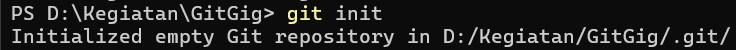
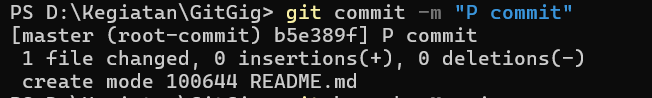
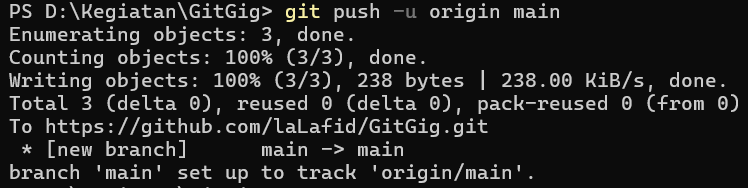
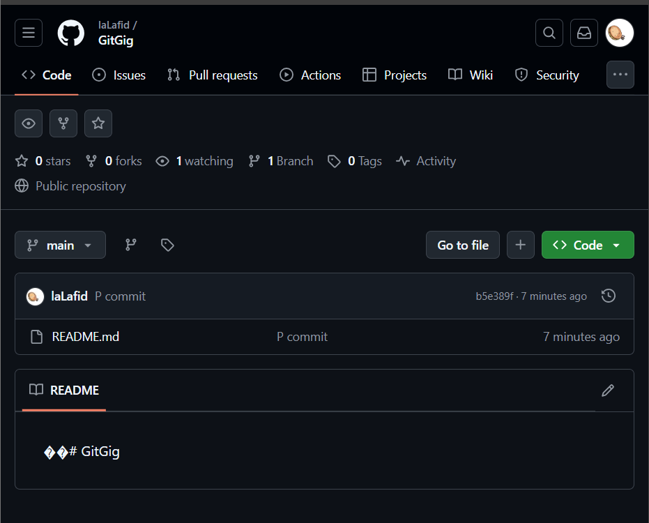
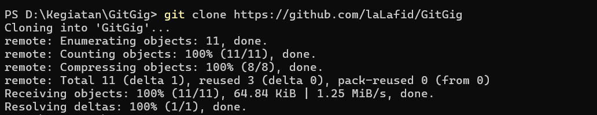

# Cara Menggunakan Git

## Persiapan 

1. [Git](https://git-scm.com/)
2. [Github](https://github.com/)

## Prep Time

Sebelum menggunakan [Git](https://git-scm.com/), pastikan bahwa [Git sudah ada](#menggunakan-git) di sistem komputer mu.

Jika [Git](https://git-scm.com/) belum terinstall di komputer mu, ikuti [petunjuk](#instalasi-git) ini:

## Instalasi Git

1. [Download Git](https://git-scm.com/downloads)
    Sesuaikan dengan komputer kalian

2. Jalankan installer Git
    Setelah menyelesaikan download, buka file installer git 

3. Proses instalasi
    Klik "Next" hingga instalasi selesai.

4. Cek instalasi
    Buka cmd/ps atau git bash untuk memastikan git sudah terinstal dengan benar.

## Menggunakan Git

1. Langkah awal untuk menggunakan Git adalah mengisi username dan email.
Seperti ini

2. Kemudian buatlah sebuah folder,

3. Masuk ke folder tersebut,

4. Jadikan folder itu repository lokal,

5. Buat file [README.md](README.md),

6. Tambahkan file [README.md](README.md),

7. Simpan perubahan di repository lokal,

8. Buat repository di [Github](https://github.com/),

9. Tambahkan alamat repository [Github](https://github.com/),

10. Kirim perubahan yang dilakukan pada repository lokal ke repository [Github](https://github.com/),

11. Inilah hasilnya di [Github](https://github.com/).

Penggunaan Git sukses 🥳

12. Kemudian ada clone repository

ini dilakukan untuk mengambil file yang ada di repository [Github](https://github.com/) lalu menaruhnya di repository lokal.